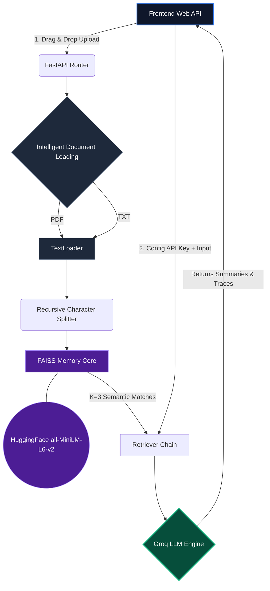

<div align="center">
  
  <h1>Rangkush RAG Dashboard</h1>
  <p><strong>A Next-Generation Retrieval-Augmented Generation (RAG) Web Application</strong></p>
  
  [](https://www.python.org/)
  [](https://fastapi.tiangolo.com/)
  [](https://vitejs.dev/)
  [](https://python.langchain.com/)
</div>

<br/>

## 📖 Overview

**Rangkush** transforms standard local script workflows into a beautiful, fully functional web dashboard. Upload your local `.pdf` and `.txt` files directly onto a modern UI, chunk massive text corpus documents into highly optimized vector embeddings, and dynamically converse with a powerful LLM—all without ever modifying configuration files manually.

## 🚀 Key Features

*   **Blazing Fast Vector Intelligence:** Powered securely and natively by local `FAISS` clustering and `HuggingFaceEmbeddings` mini-LM computations.
*   **Intelligent High-Speed Generation:** Uses **Groq's** inference mechanics (optimized via `mixtral-8x7b-32768`) hooked seamlessly through LangChain's retrieval pipelines.
*   **Dynamic Terminal Transparency:** Captures and securely streams actual native Python backend terminal outputs (standard output traces) right into the web UI interface for uncompromised observability.
*   **Luxurious Glassmorphic UI:** A beautiful dark-theme minimal UI sculpted entirely dynamically via Vite.

---

## 🏗️ Technical Architecture Workflow

The following execution tree demonstrates the synchronous flow of documents to chunks, and embedding indexing logic against prompt queries:



## 🛠️ Developer Setup & Installation

### 1. Clone the Source
```bash
git clone https://github.com/Kushal-prime/RAG-MODEL.git
cd RAG-MODEL
```

### 2. Initialize the Python Core
Ensure that your environment variables are set up accurately and virtual environments are instantiated.
```bash
python -m venv .venv
```
*Activate the Environment:*
*   **Windows**: `.venv\Scripts\activate`
*   **Unix**: `source .venv/bin/activate`

```bash
# Install critical APIs and pipelines
pip install -r requirements-api.txt
pip install -r requirements.txt
```

### 3. Initialize Visual Interface Components
Node.js dependencies must be installed for Vite architecture.
```bash
cd frontend
npm install
```

## 💻 Runtime Guidelines

Start the internal components sequentially. Ensure your environment port mappings correctly align to Localhost.

**Terminal 1 (Backend Core API System)**
```bash
# Deploys standard API connections
python api.py
```

**Terminal 2 (Frontend Client)**
```bash
# Start dynamic development server
cd frontend
npm run dev
```

Browse to your local hosted port environment (Typically `http://localhost:5173/`). Drop your LLM Key securely in the Configuration setup tab, drag your `.pdf` file in, and begin interrogating it natively!

<br />
<div align="center">
  <p>Maintainer: <b>Himanshu Garse (Kushal-prime)</b></p>
</div>
