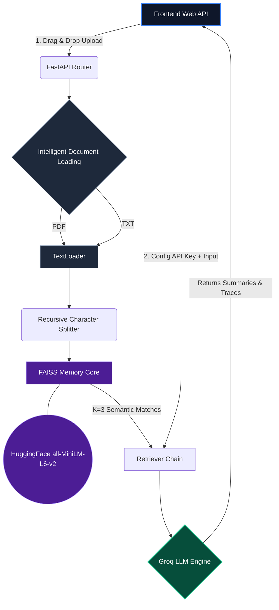

<div align="center">
  
  <h1>Rangkush RAG Dashboard</h1>
  <p><strong>A Next-Generation Retrieval-Augmented Generation (RAG) Web Application</strong></p>
  
  [](https://www.python.org/)
  [](https://fastapi.tiangolo.com/)
  [](https://vitejs.dev/)
  [](https://python.langchain.com/)
</div>

<br/>

## 📖 Overview

**Rangkush** transforms standard local script workflows into an enterprise-grade, highly scalable web dashboard. It acts as an autonomous Retrieval-Augmented Generation (RAG) agent that performs complex natural language processing (NLP) on massive local text corpus documents (`.pdf` and `.txt`). By marrying a heavily optimized FastAPI Python backend with a luxurious, dynamic Vite glassmorphic frontend, Rangkush allows users to interrogate local documents privately and dynamically without requiring manual configuration of internal node logic.

## 🚀 The Comprehensive RAG Pipeline (How It Works)

Because this project is built to handle heavy-duty document analysis, the underlying mechanics are split into multiple highly complex layers:

### 1. Ingestion & Pre-Processing Engine
When a user drags and drops a document onto the dashboard, the system bypasses standard upload limits. The FastAPI router captures the byte-stream and initiates intelligent document loading. 
- For PDFs, `PyMuPDFLoader` dissects the binary encoding to extract pure text while maintaining crucial metadata.
- For standard text arrays, `TextLoader` sanitizes the UTF-8 encoding.

### 2. Recursive Chunking & Tokenization
Large documents completely overwhelm the context windows of modern AI models. To solve this, Rangkush employs a `RecursiveCharacterTextSplitter`. 
- The text is systematically chunked into highly specific 500-character segments with a 50-character logical overlap. 
- This mathematically guarantees that no critical sentences or contextual paragraphs are severed abruptly during the slicing procedure, maintaining perfect semantic integrity.

### 3. Deep High-Dimensional Indexing (FAISS)
Once the document is shattered into logical shards, the backend utilizes `HuggingFaceEmbeddings` (specifically the mathematically rigorous `all-MiniLM-L6-v2` transformer model) to map standard human text into complex high-dimensional mathematical vectors.
- These vectors are then fired into a local **FAISS (Facebook AI Similarity Search)** clustering database.
- FAISS allows Rangkush to instantly retrieve relevant memory out of millions of potential text chunks in mere milliseconds using L2 coordinate mapping and cosine similarity logic!

### 4. Groq Intelligent Retrieval (LLM Generation)
When you type a query like *"Summarize the third chapter"*, the system mathematically locates the closest relative vectors in FAISS.
- The `x-groq-api-key` is securely relayed without caching.
- The context vectors are funneled through LangChain's hyper-advanced `create_stuff_documents_chain` into Groq's high-speed inference engine powered by `mixtral-8x7b-32768`.
- The Mixtral Engine cross-references all the mathematical embeddings, understands the core context, and instantly outputs a highly structured natural language response back to the user.

### 5. Asynchronous Bidirectional Streaming
Traditional applications hide their math from the user. Rangkush implements an advanced asynchronous `io.StringIO()` buffering pipeline that violently intercepts all native Python terminal print statements (`stdout` traces) deep in the backend logic. It captures the exact embedding calculations, document nodes, and latency outputs, streaming them directly into the beautifully styled frontend chat window for 100% developer transparency.

## 🏗️ Technical Architecture Workflow

The following execution tree demonstrates the synchronous flow of documents to chunks, and embedding indexing logic against prompt queries:



---

## 🛠️ How to Run Locally (Developer Setup)

If you'd like to clone this project and run it dynamically on your system, follow these steps:

### 1. Clone the Source
```bash
git clone https://github.com/Kushal-prime/RAG-MODEL.git
cd RAG-MODEL
```

### 2. Initialize the Python Core
Ensure that your environment variables are set up accurately and virtual environments are instantiated.
```bash
python -m venv .venv
```
*Activate the Environment:*
*   **Windows**: `.venv\Scripts\activate`
*   **Unix**: `source .venv/bin/activate`

```bash
# Install critical APIs and pipelines
pip install -r requirements-api.txt
pip install -r requirements.txt
```

### 3. Initialize Visual Interface Components
Node.js dependencies must be installed for Vite architecture.
```bash
cd frontend
npm install
```

### 4. Runtime Execution
Start the internal components sequentially. Ensure your environment port mappings correctly align to Localhost.

**Terminal 1 (Backend Core API System)**
```bash
python api.py
```

**Terminal 2 (Frontend Client)**
```bash
cd frontend
npm run dev
```

Browse to your local hosted port environment (Typically `http://localhost:5173/`) and begin talking to your documents!

<br />
<div align="center">
  <p>Maintainer: <b>Himanshu Garse (Kushal-prime)</b></p>
</div>
